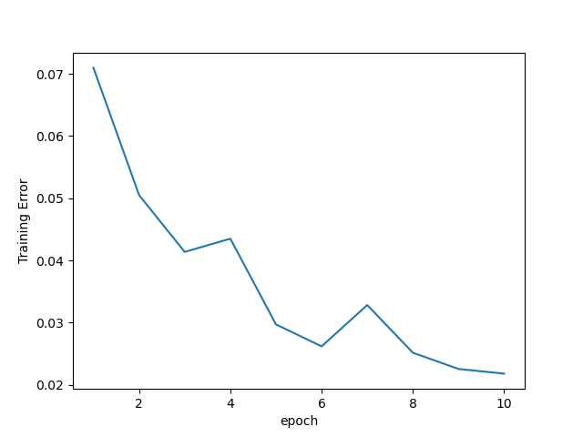

# CompuGraph - Simple Deep Learning Framework with Computational Graph

Author: 張頌宇（timcsy）

A simple C++ implementation of the deep learning framework using computational graph.

It's a simple version of TensorFlow, PyTorch, etc.

It provides python interface to pass data and receiving results, check `python/compugraph.cpp` for more information.

## Requirements
CMake (Please make sure you have install CMake!)

Python 3

pybind11 - [Homepage](https://pybind11.readthedocs.io/en/latest/)


## Setup

For Windows user, please install MinGW First!!!!

MinGW for Windows 32 bit and 64 bit: https://www.mingw-w64.org/

Suggest Download: https://github.com/mstorsjo/llvm-mingw/releases

You may have to install it at `C:\MinGW` folder and add `C:\MinGW\bin` to your PATH environment variable.

### Install as Python Package
To install as a Python package:
```
git clone https://github.com/timcsy/CompuGraph.git
pip install ./CompuGraph
```

### Build Manually
To build for testing usage (or other scenarios):
```
mkdir build
cd build
cmake .. -DPYBIND11_PYTHON_VERSION=3.8
make
```
Note: The `3.8` part can change to the Python version you currently using.

Note: Must install pybind11 first before building manually, or you can only build the library.

If you use MSVC to compile (not recommended), copy the `build/externel/bin/libopenblas.dll` to the same folder as the executable if needed (means you don't have OpenBLAS or any BLAS installed before).


## Ussage
If you want to use pure C++ library, including files in the `inlcude` folder in the project root directory, and link with the library `build/src/libcg.a`

Check header files for more information about the API.

Remember to call `Graph::initInstance();` in the beginning of your program, and call `Graph::deleteInstance();` at the end of your program.

You can see the samples in the `test` folder.

If you want to bind with Python, simply call `import compugraph`, use [pybind11](https://pybind11.readthedocs.io/en/latest/), check `python/compugraph.cpp` for more information. If you build manually, you can only import the package at the same location of the .so executable file, if you install as a Python package, you can import it anywhere.

When building the graph, it is recommended to build the network structure before eveluating the graph, and not to build the graph again after eveluation, and it will cause unexpected behaviour. For example, compile the model first before fitting, and not to compile the same model again after fitting or evaluating.


## Example - MNIST
We use MNIST for demo.

Before running the example, download [MNIST](http://yann.lecun.com/exdb/mnist/) data to `data` directory first.

Run `python mnist_example.py` in the `examples` folder to see the result, and check `python/compugraph.cpp` for network information.

### First Network
Network:
```
input: 784
hidden layer: 128 (Activation function: LeakyRelu with parameter 0.01)
output layer: 10
softmax

Loss Function: Cross Entropy

Using Gradient Descent optimizer
learning rate: 0.01

Training data size: 60000
Testing data size: 10000
Batch size: 32
Epochs: 10
Validation split ratio: 0.2
```

Result (used time: about 53s):

Training (Accuracy: 0.9782)



Validation (Accuracy: 0.9579)


Testing (Accuracy: 0.9637)

Outputs:
```
Epoch 1/10
376/375 [==============================] - loss: 2.84888 - accuracy: 0.929019 - val_loss: 2.89861 - val_accuracy: 0.925487
Epoch 2/10
376/375 [==============================] - loss: 2.25355 - accuracy: 0.94949 - val_loss: 2.10567 - val_accuracy: 0.943968
Epoch 3/10
376/375 [==============================] - loss: 1.89424 - accuracy: 0.95864 - val_loss: 1.80724 - val_accuracy: 0.948925
Epoch 4/10
376/375 [==============================] - loss: 1.90859 - accuracy: 0.956509 - val_loss: 2.06167 - val_accuracy: 0.946909
Epoch 5/10
376/375 [==============================] - loss: 1.35808 - accuracy: 0.970296 - val_loss: 1.22512 - val_accuracy: 0.957913
Epoch 6/10
376/375 [==============================] - loss: 1.33307 - accuracy: 0.973826 - val_loss: 1.17582 - val_accuracy: 0.959677
Epoch 7/10
376/375 [==============================] - loss: 1.51062 - accuracy: 0.967183 - val_loss: 1.29992 - val_accuracy: 0.953965
Epoch 8/10
376/375 [==============================] - loss: 1.2688 - accuracy: 0.97485 - val_loss: 1.30519 - val_accuracy: 0.958165
Epoch 9/10
376/375 [==============================] - loss: 1.219 - accuracy: 0.977461 - val_loss: 1.08566 - val_accuracy: 0.96161
Epoch 10/10
376/375 [==============================] - loss: 1.15905 - accuracy: 0.978213 - val_loss: 0.954418 - val_accuracy: 0.957913
Testing
313/313 [==============================] - loss: 0.26099 - accuracy: 0.9637265
```

### Second Network
Network:
```
input: 784
hidden layer: 128 (Activation function: LeakyRelu with parameter 0.01)
hidden layer: 64 (Activation function: LeakyRelu with parameter 0.01)
output layer: 10
softmax

Loss Function: Cross Entropy

Using Gradient Descent optimizer
learning rate: 0.01

Training data size: 60000
Testing data size: 10000
Batch size: 32
Epochs: 10
Validation split ratio: 0.2
```

Result (used time: about 58s):

Training (Accuracy: 0.9729)


Validation (Accuracy: 0.9613)


Testing (Accuracy: 0.9606)


Outputs:
```
Epoch 1/10
376/375 [==============================] - loss: 2.24544 - accuracy: 0.865015 - val_loss: 2.25551 - val_accuracy: 0.862987
Epoch 2/10
376/375 [==============================] - loss: 2.868 - accuracy: 0.925259 - val_loss: 2.88714 - val_accuracy: 0.915827
Epoch 3/10
376/375 [==============================] - loss: 2.39219 - accuracy: 0.945793 - val_loss: 2.2763 - val_accuracy: 0.941364
Epoch 4/10
376/375 [==============================] - loss: 2.14042 - accuracy: 0.948926 - val_loss: 2.2506 - val_accuracy: 0.942036
Epoch 5/10
376/375 [==============================] - loss: 1.5262 - accuracy: 0.958995 - val_loss: 1.44461 - val_accuracy: 0.949933
Epoch 6/10
376/375 [==============================] - loss: 1.26316 - accuracy: 0.970421 - val_loss: 1.29571 - val_accuracy: 0.959005
Epoch 7/10
376/375 [==============================] - loss: 1.35879 - accuracy: 0.965888 - val_loss: 1.27213 - val_accuracy: 0.952117
Epoch 8/10
376/375 [==============================] - loss: 1.23391 - accuracy: 0.967288 - val_loss: 1.04896 - val_accuracy: 0.954637
Epoch 9/10
376/375 [==============================] - loss: 1.14298 - accuracy: 0.975017 - val_loss: 0.924099 - val_accuracy: 0.960433
Epoch 10/10
376/375 [==============================] - loss: 1.12197 - accuracy: 0.972949 - val_loss: 0.99669 - val_accuracy: 0.961358
Testing
313/313 [==============================] - loss: 0.275588 - accuracy: 0.960611
```


## More Information
The project is heavily based on [xtensor](https://github.com/xtensor-stack/xtensor), which is a NumPy-like library written in C++, check [docs](https://xtensor.readthedocs.io) for documentation, check [From numpy to xtensor](https://xtensor.readthedocs.io/en/latest/numpy.html) to see the corresponding NumPy functions, it's not support GPU now, but it supports SIMD CPU acceleration. We put xtensor library source code in the `lib` directory.

The project is inspired by [Deep Learning From Scratch: Theory and Implementation](https://www.codingame.com/playgrounds/9487/deep-learning-from-scratch---theory-and-implementation/computational-graphs), that's a really good way to learn about computational graph.

The project has implemented some operators defined in [ONNX - Operator Schemas](https://github.com/onnx/onnx/blob/main/docs/Operators.md), which is a API describing Neural Network. Check `include/node.h` for more information about the operators.