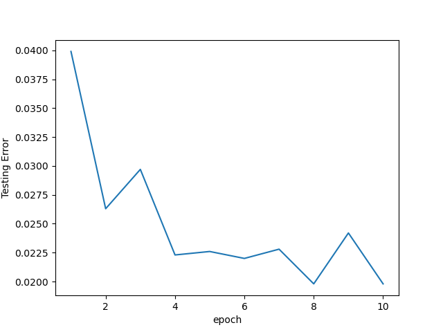
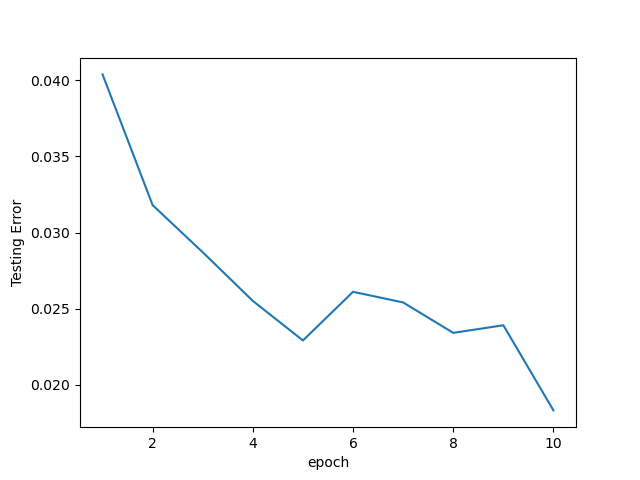

# SimpleDNN - Simple Deep Learning Framework with Computational Graph

Author: 張頌宇（timcsy）

A simple C++ implementation of the deep learning framework using computational graph.

It's a simple version of TensorFlow, PyTorch, etc.

It provides python interface to pass data and receiving results, check `python/pysimplednn.cpp` for more information.

## Requirements
CMake (Please make sure you have install CMake!)

Python 3

pybind11 - [Homepage](https://pybind11.readthedocs.io/en/latest/)


## Setup

### Install as Python Package
To install as a Python package:
```
git clone https://github.com/timcsy/SimpleDNN.git
pip install ./SimpleDNN
```

### Build Manually
To build for testing usage (or other scenarios):
```
mkdir build
cd build
cmake .. -DPYBIND11_PYTHON_VERSION=3.8
make
```
Note: The `3.8` part can change to the Python version you currently using.
Note: Must install pybind11 first before building manually.


## Ussage
If you want to use pure C++ library, including files in the `inlcude` folder in the project root directory, and link with the library `build/src/libsimplednn.a`

Check header files for more information about the API.

Remember to call `Graph::initInstance();` in the beginning of your program, and call `Graph::deleteInstance();` at the end of your program.

You can see the samples in the `test` folder.

If you want to bind with Python, use [pybind11](https://pybind11.readthedocs.io/en/latest/), check `python/pysimplednn.cpp` for more information. If you build manually, you can only import the package at the same location of the .so executable file, if you install as a Python package, you can import it anywhere.

When building the graph, it is recommended to build the network structure before eveluating the graph, and not to build the graph again after eveluation, and it will cause unexpected behaviour. For example, compile the model first before fitting, and not to compile the same model again after fitting or evaluating.


## Example - MNIST
We use MNIST for demo.

Before running the example, download [MNIST](http://yann.lecun.com/exdb/mnist/) data to `data` directory first.

Run `python test.py` to see the result, and check `python/pysimplednn.cpp` for network information.

### First Network
Network:
```
input: 784
hidden layer: 128 (Activation function: LeakyRelu with parameter 0.01)
output layer: 10
softmax

Loss Function: Cross Entropy

Using Gradient Descent optimizer
learning rate: 0.01

Training data size: 60000
Testing data size: 10000
Batch size: 32
Epochs: 10
```

Result:

Training (Accuracy: 0.9963, used time: about 55s)


Testing (Accuracy: 0.9802)



### Second Network
Network:
```
input: 784
hidden layer: 128 (Activation function: LeakyRelu with parameter 0.01)
hidden layer: 64 (Activation function: LeakyRelu with parameter 0.01)
output layer: 10
softmax

Loss Function: Cross Entropy

Using Gradient Descent optimizer
learning rate: 0.01

Training data size: 60000
Testing data size: 10000
Batch size: 32
Epochs: 10
```

Result:

Training (Accuracy: 0.9904, used time: about 65s)


Testing (Accuracy: 0.9817)




## More Information
The project is heavily based on [xtensor](https://github.com/xtensor-stack/xtensor), which is a NumPy-like library written in C++, check [docs](https://xtensor.readthedocs.io) for documentation, check [From numpy to xtensor](https://xtensor.readthedocs.io/en/latest/numpy.html) to see the corresponding NumPy functions, it's not support GPU now, but it support SIMD CPU acceleration. We put xtensor library source code in the `lib` directory.

The project is inspired by [Deep Learning From Scratch: Theory and Implementation](https://www.codingame.com/playgrounds/9487/deep-learning-from-scratch---theory-and-implementation/computational-graphs), that's a really good way to learn about computational graph.

The project has implemented some operators defined in [ONNX - Operator Schemas](https://github.com/onnx/onnx/blob/main/docs/Operators.md), which is a API describing Neural Network. Check `include/node.h` for more information about the operators.